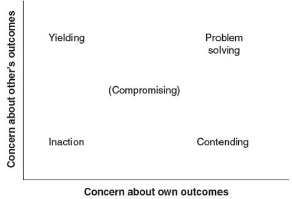

<!--

author:   Dr. Mark Jacob
email:
version:  0.0.1
language: de
narrator: UK English Female
comment: The Language of Negotiation

-->

[](https://liascript.github.io/course/?https://github.com/markjjacob/Negotiation/blob/main/TLON_Lecture_01.md)

# The Language of Negotiation - Lecture 1

> **The Nature of Negotiation**

Objectives

1. Reflect on your own understanding and experience of negotiation.
2. Understand the definition of negotiation, the key elements of a negotiation process, and the distinct types of negotiation.
3. Explain how people use negotiation to manage different situations of interdependence - that is that they depend on each other for achieving their goals.
4. Consider how negotiation fits within the broader perspective of processes for managing conflict.

## Are you a negotiator?

      {{0-4}}
> “Like it or not, you are a negotiator … Everyone negotiates something every day,”
>
> -- Roger Fisher, William Ury, and Bruce Patton in their seminal book on negotiating, ***Getting to Yes: Negotiating Agreement Without Giving In***

      {{1-2}}


      {{2-3}}
**Do you agree with this statement?**

      {{2-3}}
    [(1)] Yes
    [(2)] No

      {{3}}
- If you agree, what do you negotiate and with whom?
- If you do not agree, who do you think negotiates and in what situations?

      {{4}}
??[](https://pad.riseup.net/p/0BpGfs2vuhzBU0XuIF7E-keep)

## Are your negotiations formal or informal?

> **Formal negotiation**

- discussing the terms of a job offer with a recruiter
- haggling over the price of a new car
- hammering out a contract with a supplier

> **Informal negotiation**

- persuading a toddler to eat his peas
- working out a conflict with a co-worker
- convincing a client to accept a late delivery

## How is negotiation defined?

      {{1-3}}
> "Negotiation is “back-and-forth communication designed to reach an agreement when you and the other side have some interests that are shared and others that are opposed.”
>
> -- Getting to Yes, Roger Fisher, William Ury and Bruce Patton

      {{2-3}}


      {{3-5}}
> Negotiation is an “interpersonal decision-making process” that is “necessary whenever we cannot achieve our objectives single-handedly.”
>
> --The Mind and Heart of the Negotiator, Leigh Thompson

      {{4-5}}


      {{5}}
> “When two or more parties need to reach a joint decision but have different preferences, they negotiate.”
>
> --Judgment in Managerial Decision Making, Max H. Bazerman and Don A. Moore

      {{6}}


## What are the characteristics of a negotiation situation?

      {{1}}
> There are two or more parties.

      {{1-2}}
- Between individuals, groups, or organizations, or
- within groups.

      {{2}}
> There is a conflict of needs and desires between parties.

      {{2-3}}
- Each side searches for conflict resolution.

      {{3}}
> The parties negotiate by choice.

      {{3-4}}
- There are times to not engage in negotiation.

      {{4}}
> A give-and-take is expected.

      {{4-5}}
- Both sides compromise.

      {{5}}
> Parties prefer to negotiate.

      {{5-6}}
- Rather than fight openly, dominate, or break contact.

      {{6}}
> Negotiators must manage tangibles and resolve intangibles.

      {{6-7}}
- Tangibles include the price or terms of the agreement.
- Intangibles are underlying motivations.

  - The need to “win.”
  - The need to maintain a good relationship.

## Working interdependently, parties achieve a better outcome.

Relationships between parties may be characterized in one of three ways:

> **Independent** parties are able to meet their own needs without the assistance of others.
>
> **Dependent** parties must rely on others for what they need; they must accept and accommodate to that provider’s whims and idiosyncrasies.
>
> When the parties depend on each other to achieve their own outcome they are **interdependent**; characterized by interlocking goals.

## Types of interdependence affect outcomes.

The interdependence of people’s goals, and the structure of the situation, strongly shapes negotiation processes and outcomes.

> Zero-sum, or distributive: Competitive – there is only one winner.
>
> The individuals are so linked together that there is a negative correlation between their goal attainments.
>
> To the degree that one person achieves their goal, the other’s goal attainment is blocked.

> In a mutual-gains situation, also known as a non-zero-sum or integrative situation, there is a positive correlation between the goal attainments of both parties.
>
> To the degree that one person achieves their goal, the other’s goals are not necessarily blocked, and may in fact be enhanced.

## Evaluating interdependence also depends heavily on the desirability of alternatives to working together.

>> BATNA: Best Alternative to a Negotiated Agreement.

- Whether you should or should not agree on something in a negotiation depends upon the attractiveness of your best available alternatives.

- Negotiators must understand their own BATNA, and the other parties’.

- The value of a person’s BATNA is always relative to the possible settlements available in the current negotiation.

- A BATNA may offer independence from, dependence on, or interdependence with someone else.

- Every possible interdependency has an alternative – negotiators can walk away.

## Negotiation is a transformational process, and mutual adjustment is a key cause of the changes occurring during a negotiation.

Negotiations often begin with statements of opening positions.

1. Each party states its most preferred settlement proposal.

2. If the proposal isn’t readily accepted, negotiators begin to defend their own initial proposals and critique the others’ proposals.

3. Each party’s rejoinder usually suggests alterations to the other party’s proposal and perhaps a change in their own position.

4. When one party agrees to make a change, a concession has been made.

5. When a concession is made, the bargaining range – the range of possible agreements between the two party’s minimally acceptable settlements – is further constrained.

## Two dilemmas arise in mutual adjustment: honesty and trust.

> The dilemma of ***honesty*** concerns how much truth to tell the other.
>
> Telling the other party everything may give them the opportunity to take advantage.
>
> Not telling the other person anything may lead to stalemate.

>The dilemma of ***trust*** is how much to believe what the other tells you.
>
> If you believe everything the other party says, then they could take advantage of you.
>
> If you believe nothing they say, you will have difficulty in reaching an agreement.

## Concessions are greatly aided by trust and a belief.

Two efforts help to create such trust and beliefs – one is based on perceptions of **outcomes** and the other on perceptions of the **process**.

> **Outcome** perceptions can be shaped by managing how the receiver views the proposed result.

> Enhance perceptions of the credibility of the **process** by signalling fairness and reciprocity in proposals and concessions.

## The structure of the interdependence shapes the strategies and tactics negotiators employ.

      {{1-2}}
Negotiators use win-lose strategies in distributive situations.
In distributive bargaining, the negotiator accepts the ‘one winner’ concept and pursues action to be the winner.
The purpose of this type of negotiation is to

      {{2-3}}
```    ascii
  +-------------+
  | CLAIM VALUE |
  +-------------+
```
      {{3-4}}
Negotiators use win-win strategies in integrative situations.
Integrative negotiation attempts solutions so both parties can achieve their goals.
The purpose of the negotiation is to

      {{4-5}}
```    ascii
+--------------+
| CREATE VALUE |
+--------------+
```

## Most negotiations are a combination of claiming and creating value, and there are significant implications to this.

- Negotiators must be able to recognize when to use more of one approach than the other.
- Negotiators must be versatile in their use of both strategic approaches.
- Negotiator perceptions tend to see problems as more distributive than they really are.
- People tend to overuse distributive strategies.
- As a consequence, negotiators often leave unclaimed value on the negotiation table.

Successful coordination of interdependence has the potential to lead to synergy, which is the notion that “the whole is greater than the sum of its parts.”

## Value may be created in numerous ways, and the heart of the process lies in exploring and exploiting the differences between the negotiators.

Differences in interests.

- Finding compatibility is often the key to value creation.

Differences in judgments about the future.

- People differ in their perception of future value of an item.

Differences in risk tolerance.

- A company with a cash flow problem can assume little risk.

Differences in time preference.

- One negotiator may want to realize gains now, while the other may be happy to defer gains into the future.

## Conflict is a disagreement or opposition, and includes the belief that the parties’ current needs cannot be achieved simultaneously.

      {{0-1}}


      {{1}}
**Conflict arises:**

      {{2}}
- From the strongly divergent needs of the two parties.

- From misperceptions and misunderstandings.

- When the two parties are working toward the same goal and generally want the same outcome.

- When both parties want very different outcomes.

## Conflict arises at different levels of individual or group.

Intrapersonal or intrapsychic conflict.

- Conflict occurs within an individual.

Interpersonal conflict.

- This is conflict between individuals.

Intragroup conflict.

- This is conflict within a group.

Intergroup conflict.

- This is conflict between organizations, ethnic groups, warring nations, or feuding families or within splintered, fragmented communities.

- Negotiations at this level are the most complex.

## The objective is not to eliminate conflict but to learn how to manage it to control the destructive elements while enjoying the productive aspects.

      {{1-3}}
Elements that contribute to conflict’s destructive image:

      {{2-3}}
- Competitive, win-lose goals.

- Misperception and bias.

- Decreased communication.

- Magnified difference, minimized similarities.

- Emotionality.

- Blurred issues.

- Rigid commitments.

-	Conflict escalation.

      {{3}}
Conflict’s productive aspects.

      {{4}}
- Discussion raises awareness and coping ability.

- Conflict leads to change and adaptation.

- Conflict strengthens relationships and morale.

- Conflict promotes awareness of self and others.

- Conflict enhances personal development.

- Conflict encourages psychological development.

- Conflict can be stimulating and fun.

## Dimensions of a conflict can be difficult or easy to resolve.

| Dimension                 | Difficult to Resolve       | Easy to Resolve                |
| ------------------------- |:--------------------------:| ------------------------------:|
| Issue in question         | Matter of “principle”      | Divisible                      |
| Size of stakes            | Large                      | Small                          |
| Interdependence           | Zero sum                   | Positive                       |
| Continuity of interaction | Single transaction         | Long-term relationship         |
| Party structure           | Disorganized               | Organized                      |    
| Third parties             | No neutral party available | Powerful third party available |
| Conflict progress         | Unbalanced                 | Balanced                       |

## According to the Dual Concerns Model, behaviour depends on concern about one‘s own and others‘ outcomes.



## The Negotiator: Never Say No

      {{0-1}}
- What kind of outcome or outcomes from the Dual Concerns model does this statement associate most with?
- Have you ever heard the word no or said it? How does it feel to be on the giving versus receiving end?

      {{1}}
- What is going on in this scene?
- What are the emotions from the respective parties?
- What negotiation styles are used?

      {{2}}
!?[alt-text](https://www.youtube.com/watch?v=GtARiQO8ljE)

      {{3-4}}
- Are the outcomes you considered at the beginning true?
- Is there anything you would have done differently?
- Can we diagnose the situation using the Conflict Diagnostic Model?

## Final slide

Thanks for your participation!

Dr. Mark Jacob
Dr. Stephan Meschke
