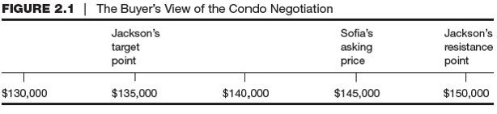
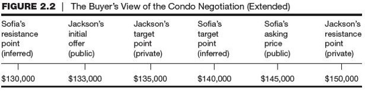
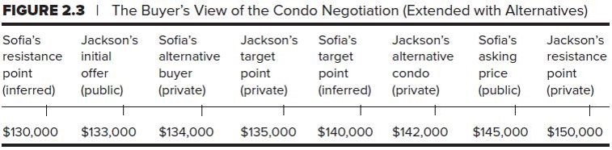
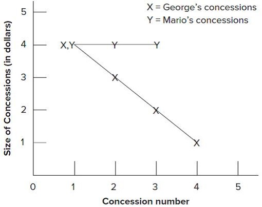

<!--

author:   Dr. Mark Jacob
email:
version:  0.0.1
language: en
narrator: UK English Female
comment: The Language of Negotiation 02
icon: ./img/TUBAF_Logo_orig_RGB.jpg

-->

# The Language of Negotiation - Strategy and Tactics of Distributive Bargaining

      {{0-1}}

## Objectives

1. Understand the basic elements of distributive bargaining including the strategy and tactics of distributive bargaining.
2. Consider the strategic impact of positions taken during a negotiation and the role of concessions.
3. Appreciate the role of concessions in distributive bargaining.
4. Identify hardball tactics and learn how to counter them.

## Initial questions on distributive bargaining

### What is distibutive bargaining?

    {{1}}
> Distributive bargaining is a competition over who is going to get the most of a limited resource.

### Are you comfortable with distributive bargaining?

### Why should you try to understand distributive bargaining?

      {{1}}
1. Some interdependent situations are distributive.

      {{2}}
2. You should know how to counter distributive tactics.

      {{3}}
3. Every negotiation may require distributive skills during the “claiming value” stage.

      {{4}}
> Understanding these concepts allow negotiators not comfortable with distributive bargaining to manage the situations proactively.

## Target points, resistance points, and initial offers all play important roles in distributive bargaining.

      {{1-7}}
A **TARGET POINT** is a negotiator’s optimal goal.

      {{2-7}}
A **RESIISTANCE POINT** is a negotiator’s bottom line.

      {{3-7}}
The **ASKING PRICE** is the initial price set by the seller.

      {{4-7}}
The buyer may counter with an **INITIAL OFFER**.

      {{5-7}}
Both parties should set their starting, target, and resistance points before negotiating.

      {{6-7}}
- Staring points are **public**.
- Target points are **inferred**.
- Resistance points are **secret**.

      {{7}}
The spread between the resistance points is the bargaining range, settlement range, or zone of potential agreement.

      {{8}}
When a buyer’s resistance point is above the seller’s:
There is a positive bargaining range.

      {{9}}
When the seller’s resistance point is above buyer’s:
There is a negative bargaining range.

### Price continuum for condo purchase

    --{{1}}--
**Figure 2.1** provides a price continuum in \$5,000 increments from \$130,000 to \$150,000.  The buyer’s target point of \$135,000 is identified, as is the seller’s \$145,000 asking price. \$150,000 marks the buyer’s resistance point.

      {{1}}

    --{{2}}--
**Figure 2.2** shows the same continuum as before but this one has extended information included. The seller’s inferred resistance point is now identified as \$130,000 and the buyer’s public initial offer is marked at \$133,000.  The buyer’s target point, which is kept private, is next on the continuum at \$135,000 and the seller’s inferred target point follows at \$140,000.  The last two amounts on the price continuum are the seller’s asking price at \$145,000 and the buyer’s resistance point, again kept private, at \$150,000.

      {{2}}

### The Role of Alternatives to a Negotiated Agreement

    --{{1}}--
**Figure 2.3** provides the same price continuum as the previous two examples but this continuum is extended to include alternatives available to both the buyer and the seller.
The seller’s inferred resistance point is still set at \$130,000 and the buyer’s public initial offer is \$133,000.  In this example the seller has an alternative buyer offering \$134,000 but this information is kept private.  The next price on the continuum is the buyer’s target point at \$135,000, also kept private, followed by the seller’s inferred target point of \$140,000.  The next price on the continuum is the buyer’s alternative condo with a price of \$142,000 but this information is kept private.  The seller’s public asking price come next at $145,000 and the final price on the continuum is the buyer’s private resistance point of \$150,000.

      {{1-3}}

      {{2}}
> Negotiators also need to consider what their BATNAs, or WATNAs are.

      {{3}}
- Alternatives give negotiators the power to walk away.
- Attractive alternatives mean negotiators can set their goals higher and make fewer concessions.
- Good bargainers know their BATNAs from the start but continually try to improve the BATNA during the negotiation.
- Strong BATNAs influence how a negotiation unfolds.

### The fundamental process of distributive bargaining is to reach a settlement point within a positive bargaining range.

- The objective of both parties is to obtain as much of the bargaining range as possible.
- In other words, to reach an agreement as close to the other party’s resistance point as possible.
- Both parties know they might have to settle for less than their target point, but hope the agreement will be better than their own resistance point.
- For agreement to occur, both parties must believe that the settlement is the best that they can get (within a positive bargaining range).

### Discovering the Other Party’s Resistance Point

> Information is the life force of negotiation.

- The more you can learn about the other party’s information, the more able you will be to strike a favorable settlement.
- At the same time, you do not want the other party to know your resistance point, some of your targets, and information about a weak strategic position or an emotional vulnerability.  
- Each side wants to obtain and conceal information, and communication can become complex – evolving into a coded language.

### Influencing the Other Party’s Resistance Point

> Central to planning the strategy and tactics is locating the other party’s resistance point and the relationship of that resistance point to your own.
The resistance point is established by:

- The value the other attaches to a particular outcome.
- The costs the other attaches to delay or difficulty in negotiations.
- The cost the other attaches to having the negotiations aborted.

When influencing the other’s viewpoint, you must also deal with:

- the other party’s understanding of your value for a particular outcome,
- the costs you attach to delay or difficulty in negotiation,
and your cost of having the negotiation aborted.

### There are four major ways to weaken the other party’s resistance point.

1. Reduce the other party’s estimate of your cost of delay or impasse.
2. Increase the other party’s estimate of their own cost of delay or impasse.
3. Reduce the other party’s perception of the value of an issue.
4. Increase the other party’s perception that you value an issue.

## There are four important tactical tasks for a negotiator to consider in a distributive bargaining situation

1. Assess the other party’s target, resistance point, and cost of terminating negotiations.
2. Manage the other party’s impression of your target, resistance point, and cost of terminating negotiations.
3. Modify the other party’s perception of their own target, resistance point, and cost of terminating negotiations.
4. Manipulate the actual costs of delaying or terminating negotiations.

### TASK 1: Assess the Other Party’s Target, Resistance Point, and Costs of Terminating Negotiations

> The purpose is to identify what the other party really wants to achieve, as well as how much they are willing to pay.

**INDIRECT ASSESSMENT** Obtain information indirectly about the background factors behind an issue.

- Determine what information a negotiator used to set target and resistance points.
- Study how they may have interpreted the information.

**DIRECT ASSESSMENT** Obtain information directly from the other party about their target and resistance points.

- When at the limit, the other party may reveal information.
- Most of the time, the other party is not forthcoming and methods of obtaining information are complex.

### TASK 2: Manage the Other Party’s Impressions of Your Target, Resistance Point, and Cost of Terminating Negotiations

Negotiators need to screen information about their own positions and represent them as they would like the other to believe.
Screening activities are more important at the beginning of negotiation, and direct action is more useful later on.

Screening Activities.

- Concealment is the most general screening activity.
- Calculated incompetence may be a useful approach.
- Channel communication through a team spokesperson.
- Present many items, only a few important to you.

Direct Action.

- Selective presentation – reveal only the necessary facts.
- Explain or interpret known facts to present a logical argument.
- Display an emotional reaction.
- Ethics are a concern.
- It may backfire.

### TASK 3: Modify the Other Party’s Perceptions of His or Her Target, Resistance Point, and Cost of Terminating Negotiations

A negotiator can alter the other party’s impressions of their own objectives by making outcomes appear less attractive or by making the cost of obtaining them appear higher.

The negotiator may also try to make demands and positions appear more attractive or less unattractive to the other party.
There are several approaches to modifying the other party’s perceptions.
One approach is to interpret for the other party what the outcomes of their proposal will really be.

### TASK 4: Manipulate the Actual Costs of Delaying or Terminating Negotiations

Extending negotiations beyond a deadline can be costly.
The ultimate weapon in negotiation is to threaten to terminate negotiations, denying both parties the possibility of a settlement.

There are three ways to manipulate the costs of delay in negotiation.

1. **Disruptive Action**. Public picketing, boycotting a product or company, and locking negotiators in a room until an agreement is reached.
2. **Alliance with Outsiders**. Involve other parties who can influence the outcome in the process.
3. **Schedule Manipulation**. Negotiation schedules can be used to increase time pressure.

## Video "Just Go with it"

{{0-3}}
Before watching the video, discuss the following questions:

{{1-3}}
> Have you ever felt cheated out of a negotiation? How did it make you feel?

{{2-3}}
Context to video: Adam Sandler tries to negotiate with the girl, who is an aspiring actor, to pretend to be his kid for a trip to Hawaii.

{{3-5}}
During: Think about the target points, resistance points, initial offers, bargaining range and settlement point.

{{4-5}}
!?[alt-text](https://www.youtube.com/watch?v=898OUCyBulM)

{{5}}
After watching the video, discuss your notes with a partner and then share them with the class.

{{6}}
??[video notes](https://pad.riseup.net/p/cmRxukj6Wp4zGk8_raT--keep)

## Positions taken during negotiation

- Opening offers
- Opening stance
- Initial concessions
- Role of concessions
- Pattern of Concession making
- Final offers
- Closing the Deal

### Opening Offers

**Advantages**

Making the first offer is advantageous as it can anchor a negotiation.
Higher initial offers have a strong effect on negotiation outcomes.

Exaggerating an opening offer is advantageous.

- It gives the negotiator room for movement.
- It may create an impression in the other party’s mind of a long way to a settlement.
- It will also suggest there will be many concessions to make.
- It may make the other party reconsider their own resistance point.

**Disadvantages**

Two disadvantages to exaggerating an opening offer include:

1. Potential rejection by the other party, halting negotiations prematurely.
2. The perception of a “tough” attitude can harm a long-term relationship.

### Opening Stance

- A second decision negotiators should make concerns the stance, or attitude, to adopt during the negotiation.

- Competitive or moderate?
Negotiators tend to match distributive tactics from the other party with their own distributive tactics.

- To communicate effectively, a negotiator should try to send a consistent message through both the opening offer and opening stance.

- When the messages are in conflict, the other party will find them confusing to interpret and answer.

- Timing also plays a part.

### Initial Concessions

An opening offer is usually met with a counteroffer, and these two offers define the **initial bargaining range**.

The first concession conveys a message, frequently a symbolic one, to the other party about how you will proceed.
Negotiators who take a hard line achieve better economic outcomes, but at a cost of being perceived negatively by the other party.

There are good reasons for adopting a flexible position.

- When taking different stances throughout the negotiation, you can learn about the other party’s targets and perceived possibilities.
- By observing how they respond to different proposals.
- Flexibility keeps the negotiations proceeding – the more flexible you seem, the more the other party will believe a settlement is possible.

### Role of Concessions

> Concessions are central – without them, negotiation would not exist.

- Immediate concessions are perceived less valuable than gradual, delayed concessions.
- Negotiators generally resent a take-it-or-leave-it approach. Parties feel better about a settlement when the negotiation involves a progression of concessions.
- Concessions imply recognition of the other’s position and its legitimacy.
- A reciprocal concession cannot be haphazard.
- Negotiators may not accept inadequate reciprocal concessions.
- Packaging concessions can lead to better outcomes than making concessions singly on individual issues.

### Pattern of Concession Making

   {{0-1}}
The pattern of concessions contains information, but it may be difficult to interpret.
When successive concessions get smaller, the concession maker’s position is getting firmer and the resistance point is being approached.
Note that a concession late in negotiations may also indicate that there is little room left to move.

    --{{1}}--
This grid shows the patterns of concessions for two salesmen.
Mario makes three concessions, each worth $4 per unit, for a total of $12.
George makes four concessions, worth $4, $3, $2, and $1 per unit, for a total of $10.
Both say they have conceded all they can but George is more likely to be believed as his pattern of concessions signal there is nothing left to concede.
Mario is less likely to be believed as his three equal concessions signal there is plenty more to concede, even though he has already conceded more than George.

   {{1}}

### Final Offers

Eventually, a negotiator wants to convey the message that there is no further room for movement.

- A simple absence of further concessions conveys the message, but the other party may feel the pattern of concessions is being violated.

One way to accomplish this is to make the last concession more substantial.

- Large enough to be dramatic yet not so large it creates suspicion that the negotiator has been holding back.

A concession may also be personalized to the other party signaling this is the last concession the negotiator will make.

- “I went to my boss and got a special deal just for you.”

### Closing the Deal

**Provide Alternatives**

- Provide two or three alternative packages for the other party that are roughly equal in value.

**Assume the Close**

- After a discussion about buyer needs and positions, act as if the decision to purchase has already been made.

**Split the Difference**

- The negotiator summarizes the negotiation and suggests “why not just split the difference?”

**Exploding Offers**

- Contains an extremely tight deadline in order to pressure the other party to agree quickly.
- The purpose is to convince the other party to accept the settlement and to stop considering outcomes.

**Sweeteners**

- Save a special concession for the close.
- “I’ll give you X if you agree to the deal.”

## Hardball Tactics

- Hardball tactics work best against poorly prepared negotiators.

- They can also backfire.

- Many find the tactics offensive and out-of-bounds.

- Difficult to enact, each involves risk for the person using it.

> It is important to understand hardball tactics and how they work so you can recognize if hardball tactics are used against you.

### There are four main options negotiators have for responding to typical hardball tactics.

1. **Discuss Them**

Label the tactic and offer to negotiate the process itself before continuing.

2. **Ignore Them**

Ignoring a hardball tactic can be very powerful – the tactics take a lot of energy to enact properly.

3. **Respond in Kind**

May be the most useful when dealing with another party who is testing your resolve or as a response to exaggerated positions.

4. **Co-opt the Other Party**

It is more difficult to attack a friend than an enemy.

### Typical Hardball Tactics

- Good Cop/Bad Cop
- Lowball/Highball
- The Bogey
- The Nibble
- Chicken
- Intimidation
- Aggressive Behavior
- Snow Job

#### Good Cop/Bad Cop

It often leads to concessions and negotiated agreements but the tactic has many weaknesses.

- Relatively transparent, especially with repeated use.
- Easily countered by the other party who may call you out on the tactic.
- Difficult to enact – requires a lot of energy in making the tactic work.
- It may alienate the other party.
- Negotiators may get involved in the game and fail to concentrate on their goals.

#### Lowball/Highball

Negotiators start with a ridiculously low (or high) opening offer they know they will never achieve.

- Theory is the extreme offer will cause the other party to reevaluate their opening offer and move close to or beyond their resistance point.
- Risk in using this tactic - the other party may think it is a waste of time to negotiate and stop the process.

> The best way to deal with a lowball/highball tactic is not to make a counteroffer.
- Insist the other party start with a reasonable opening offer and refuse to negotiate further until they do
- Show the other party that you won’t be tricked.
- Threaten to leave the negotiation.
- Respond with an extreme counteroffer.

#### The Bogey

Negotiators use this tactic to pretend that an issue is of little or no importance to them, when it actually is quite important.

- Later this issue can be traded for major concessions on issues that are actually important to them.

  - Most effective when a negotiator identifies an issue that is quite important to the other side but of little value to themselves.

- This tactic is fundamentally deceptive, and can be difficult to enact.

Although difficult to defend against, being well prepared for the negotiation will make you less susceptible to it.

- If the other party takes a position opposite of your expectations, suspect a bogey tactic and ask probing questions.

- Be cautious about sudden reversals in positions, especially late in the negotiation – again, question the other party carefully.

#### The Nibble

> Negotiators use the nibble tactic for a proportionally small concession on an item that hasn’t been discussed previously in order to close the deal.

Weaknesses in using the nibble.

- Many feel the party using the nibble did not bargain in good faith.
- The person being nibbled will not feel good about the process.

Combating the nibble tactic.

- Respond with each nibble with the question “What else do you want?”
- Have your own nibbles prepared for exchange.

#### Chicken

Combining a large bluff with a threatened action to force the other party to “chicken out” and give them what they want.

- Weakness of tactic.

  - Turns the negotiation into a serious game in which one or both parties find it difficult to distinguish reality from postured negotiation positions.

> Difficult to defend against.
> Preparation and understanding of the situation is essential for identifying where reality ends and the chicken tactics begin.

#### Intimidation

> An attempt to force the other party to agree by means of an emotional ploy, usually anger or fear.

Intimidation may include increasing the appearance of legitimacy.

- The greater the appearance of legitimacy, the less likely the other party will be to question the process.

Guilt can also be used to intimidate.

- This places the other party on the defensive.

Dealing with intimidation tactics.

- Do not allow yourself to feel threatened.
- Discuss the negotiation process with them.
- Ignore the other party’s attempts to intimidate you.
- Use a team to negotiate.

#### Aggressive Behavior

Aggressive tactics include:

- Relentless push for further concessions.
- Asking for the best offer early in negotiations.
- Asking the other party to explain and justify their proposals.

An excellent response is to halt the negotiations in order to discuss the negotiation process itself.

- Having a team to counter aggressive tactics can be helpful.
- Good preparation makes responding easier as negotiators can highlight the merits to both parties of reaching an agreement.

#### Snow Job

> Negotiators overwhelm the other party with so much information that they have trouble determining important facts from distractions.
>
> - Another example is the use of highly technical language to hide a simple answer to a question asked by a non-expert.
> - The snow job can backfire as it interferes with the ability of negotiators to concentrate on what is important in order to reach agreements.

Negotiators can use the following to counter a snow job tactic.

- Ask questions until you receive an answer you understand.
- If the matter is highly technical, suggest that technical experts get together to discuss the issues.
- Listen carefully to the other party and identify consistent and inconsistent information.
- Strong preparation is important for defending against the snow job.
