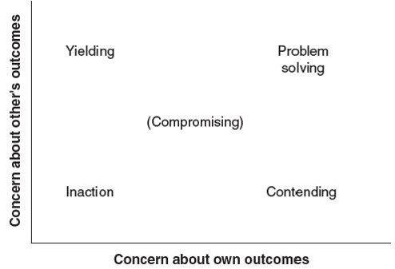

<!--

author:   Dr. Mark Jacob
email:
version:  0.0.1
language: en
narrator: UK English Female
comment: The Language of Negotiation 03
icon: ./img/TUBAF_Logo_orig_RGB.jpg

-->

[](https://liascript.github.io/course/?https://github.com/markjjacob/Negotiation/blob/main/TLON_Lecture_03.md)

# The Language of Negotiation - Strategy and Tactics of Integrative Negotiation

{{0-5}}


{{1-5}}
Would you like to take part in this negotiation?

{{2-5}}
[(Yes)] Yes, I would.
[(No)] No, I wouldn't.
[(Maybe)] Maybe

{{3-5}}
Integrative negotiation allows both sides to achieve their objectives.

{{4-5}}
Discussion and mutual exploration often suggest alternatives where both parties gain.

{{5-7}}
What does this remind us of from the first lecture?

{{6-7}}


{{7}}
Successful integrative negotiator traits:

{{8}}
- Honesty and integrity.
- Abundance mentality.
- Maturity.
- Systems orientation.
- Superior listening skills.


{{8}}
Rate yourself:

{{9}}
    [[Low][Below average][Above average][High]]
    [                                         ] Honesty and integrity ?
    [                                         ] Abundance mentality ?
    [                                         ] Maturity ?
    [                                         ] Systems orientation ?
    [                                         ] Superior listening skills ?

## Overview of the Integrative Negotiation Process

> Key contextual factors include:

- Creating a free flow of information.
- Attempting to understand the other negotiator’s real needs and objectives.
- Emphasizing things parties have in common.
- Searching for solutions that meet the goals and objectives of both parties.

> Managing integrative negotiations involves creating a process to:

- Identify and define the problem.
- Surface interests and needs.
- Generate alternative solutions.
- Evaluate and select alternatives.

### Creating a Free Flow of Information 

> Effective information exchange promotes the development of good integrative solutions.

- Failure to reach integrative agreements is often linked to the failure to exchange enough information to allow identifying integrative options.

> For the necessary exchange to occur:

- Negotiators must be willing to reveal their true objectives and to listen to each other carefully.

> In contrast, a willingness to share information is not a characteristic of distributive bargaining situations.

- The parties distrust each other, conceal and manipulate information, and wish to learn about the other for their own competitive advantage.

### Attempting to Understand the Other Negotiator’s Real Needs and Objectives

>> You must understand the other’s needs before helping to satisfy them.

> Realize the other’s priorities are not your own.
- Stimulate information exchange.
> Exchange information about your priorities for particular issues.
- But not necessarily about your positions on those issues.
> Make an effort to understand what the other side really wants to achieve.
- This is in contrast to distributive bargaining.
> If one negotiator is inexperienced, the other may need to assist them in discovering their underlying needs and interests.

### Emphasizing Things in Common between the Parties and Minimizing the Differences

> Negotiators may require a different outlook or frame of reference.
- Individual goals may need to be redefined through collaborative efforts directed toward a collective goal.
- At times the collective goal is clear and obvious, and other times it is not clear or easy to keep in sight.


### Searching for Solutions That Meet the Needs and Objectives of Both Sides

> The success of integrative negotiation depends on the search for solutions that meet the needs and objectives of both sides.
 
- In this process, negotiators must be firm but flexible.

  - Firm about their primary interests and needs.

- But flexible about how these needs and interests are met.

> In a competitive interaction:
> 
> - Negotiators ensure that what the other obtains does not diminish their own accomplishments.
> - Negotiators may block the other from obtaining their objectives due to a strong desire to win.
> 
> In contrast, integrative negotiation requires both negotiators to define and pursue their own goals.
> 
> - But also be mindful of the other’s goals.
> - And search for solutions satisfying both sides.

>> If the objective of one party is to get more than the other, successful integrative negotiation is very difficult.

## Key Steps in the Integrative Negotiation Process

> The **first three** steps are important for creating value.
> 
> The **fourth** step involves claiming value.

***Table 3.1 Key Steps in the Integrative Negotiation Process***

```    ascii
  +---------------------+   +-------------------+   +----------------------+   +---------------------+
  | Identify and define |   | Surface interests |   | Generate alternative |   | Evaluate and select |
  | the problem         +-->| and needs         +-->| solutions            +-->| alternatives        +
  |                     |   |                   |   |                      |   |                     |
  +---------------------+   +-------------------+   +----------------------+   +---------------------+
```

> It is important that processes to create value precede those to claim value for two reasons:
- First, the creating-value process is more effective when it is done collaboratively and without a focus on who gets what, and
- Second, because claiming value involves distributive bargaining processes, and may derail the focus on creating value and may even harm the relationship unless it is introduced effectively.

### Figure 3.1: Creating and Claiming Value and the Pareto Efficient Frontier

> The goal of creating value is to push the solutions to the Pareto efficient frontier, and has the point where no agreement would make any party better off without decreasing the outcomes to any other party.


### Step 1:  Identify and Define the Problem

> The problem identification step is often the most difficult one, but critical.

- Define the problem in a way that is mutually acceptable to both sides.

  - Problem definition is, and should be, separate from any effort to generate or choose alternatives.

- State the problem with an eye toward practicality and comprehensiveness.
- State the problem as a goal and identify obstacles to attaining the goal.
- Depersonalize the problem.
- Separate the problem definition from the search for solutions.

  - It is important not to jump to solutions until the problem is fully defined.

### Step 2:  Surface Interests and Needs

> Interests are the underlying concerns, needs, desires, or fears that motivate a negotiator to take a particular position.

- Understanding interests allows negotiators to invent a solution that meets the interests of both sides.

  - A solution that was not apparent before negotiation.

> When two parties begin negotiation, they expose their position or demands.
> 
> - In distributive bargaining, negotiators trade positions back and forth, attempting to achieve a settlement as close to their targets as possible.
>
> - In integrative negotiation, both negotiators pursue the other’s thinking and logic to determine what motivated them to arrive at their goals.
> 
>  - Presumably, if both parties understand the other’s motivating factors, they may recognize similar interests and envision new options that both will endorse.

#### Types of Interests

>> Several types of interests may be at stake, and each type may be either:
>> 
>> - Intrinsic - the parties value it in and of itself, or 
>> 
>> - Instrumental - the parties value it because it helps them derive other outcomes in the future.

- Substantive interests are related to the focal issues under negotiation.
- Process interests are related to how the negotiation unfolds.
- Relationship interests speak to the value of the ongoing relationship between the parties and the future of that relationship.
- Interests in principle occurs when certain principles deeply held by the parties serve as the dominant guides to their actions.

#### Some Observations on Interests

*There is almost always more than one type of interest underlying a negotiation.*

- The categories are not exclusive.

*Parties can have different types of interests at stake.*

- Parties may differ on questions of principle or process.

*Interests often stem from deeply rooted human needs or values.*

- Such as Maslow’s well-known hierarchy of needs.


*Surfacing interests.*

- Ask yourself what you want from this negotiation and why you want it.
- Ask probing questions of the other party to determine their interests.

*Surfacing interests is not always easy or to one’s best advantage.*

- Focusing on interests alone oversimplifies or conceals the real dynamics of a conflict.

### Step 3:  Generate Alternative Solutions

>> The objective is to create a variety of options or possible solutions to the problem

Techniques for generating alternative solutions fall into two general categories.

1. The first requires negotiators to reframe the problem to create win-win alternatives out of what earlier appeared to be a win-lose problem.
2. The second takes the problem as given and creates a long list of options from which the parties can choose.

In integrative negotiation over a complex problem, both types of techniques may be used and even intertwined.

#### Inventing Options: Generating Alternative Solutions by Redefining the Problem or Problem Set

> Techniques in this category call for the parties to define their underlying needs and to develop alternatives to meet them.

*Logroll.*

- Parties trade off for preferred outcomes on one issue.

*Expand the pie.*

- So both sides achieve their objectives.

*Modifying the resource pie.*

- To benefit both sides.

*Find a bridge solution.*

- Invent new options to meet the needs of both sides.

*Nonspecific compensation.*

- One side wins, the other is compensated.

*Cut the costs for compliance.*

- One side wins, the other has costs minimized.

*Superordination.*

- Differences are replaced by other interests.

*Compromise.*

- For entrenched parties.

#### Generating Alternative Solutions to the Problem as Given

> These approaches can be used by the negotiators themselves or by a number of other parties.

*Brainstorming.*

- Avoid judging or evaluating solutions.

- Separate the people from the problem.

- Be exhaustive and ask outsiders.

*Surveys.*

- Can be conducted in a short time but parties cannot benefit from seeing and hearing each other’s ideas.

*Electronic brainstorming.*

- A facilitator asks questions, participants type their anonymous responses into a computer which aggregates and displays the entries to the group as a whole

### Step 4:  Evaluate and Select Alternatives

There are a series of steps for guidance.

- Definitions and standards.

- Alternatives.

- Evaluation.

- Selection.

Negotiators should weigh or rank-order each option against clear criteria.

- May need to return to definitions or return to standards for clarifying.

Parties will engage in a decision-making process, debating the merits of each negotiator’s preferred options and agree on the best options.

- Pay attention to the relationship and make sure the process does not harm the relationship at this stage.

#### Guidelines for Evaluating and Selecting Alternatives

1. Narrow the range of solution options.

2. Evaluate solutions on the basis of quality, standards, and acceptability.

3. Agree to the criteria in advance of evaluating options.

4. Be willing to justify personal preferences.

5. Be alert to the influence of intangibles in selection options.

6. Use subgroups to evaluate complex options.

7. Take time out to cool off.

8. Explore different ways to logroll.

- Explore differences in risk preference.

- Explore differences in expectations.

- Explore differences in time preferences. 

Keep decisions tentative and conditional until all aspects of the final proposal are complete.

Minimize formality and recordkeeping until final agreements are closed.

## Factors That Facilitate Successful Integrative Negotiation

> Successful integrative negotiation occurs when the parties are predisposed to finding a mutually acceptable joint solution.

Here, we review seven factors that facilitate successful integrative negotiation.

1. The presence of a common goal.

2. Faith in one’s own problem-solving ability.

3. A belief in the validity of the other party’s position.

4. The motivation and commitment to work together.

5. Trust.

6. Clear and accurate communication.

7. An understanding of the dynamics of integrative negotiation.

### Three types of goals – common, shared, and joint – may facilitate the development of integrative agreements.

1. A *common goal* is one that all parties share equally, each one benefiting in a way that would not be possible if they did not work together.
2. A *shared goal* is one that both parties work toward but that benefits each party differently.
3. A *joint goal* is one that involves individuals with different personal goals agreeing to combine them in a collective effort.

> The key element of integrative negotiation is the belief that all sides can benefit and they will be better off working in cooperation than by working independently or competitively.

### Faith in one’s ability at integrative negotiation is positively related to successful integrative negotiations.

Parties who believe they can work together are more likely to do so.

- Expertise in the problem area strengthens understanding of the problem’s complexity, nuances, and possible solutions.
- Expertise increases the negotiator’s knowledge base and confidence.

  - Both necessary to approach the problem with an open mind.

- Direct experience in negotiation increases the negotiator’s understanding of the bargaining process.
- There is also evidence that knowledge of integrative tactics leads to an increase in integrative behavior.

### Integrative negotiation requires negotiators to accept both their own and the other’s attitudes, interests, and desires as valid.

- You must believe in the validity of your own perspective—that what you believe is worth fighting for and should not be compromised.

- You must also accept the validity of the other party’s perspective.

  - The purpose of integrative negotiation is not to challenge the other’s perspective but to incorporate it into the solution.

  - The other’s views should be valued no less or more than your own.

### The Motivation and Commitment to Work Together

> For integrative negotiation to succeed, the parties must be willing to make their own needs explicit, to identify similarities, and to recognize and accept differences.

Ways to enhance motivation and commitment to problem solving.

- Negotiators agree they gain more by working together than separately.

- Negotiators can commit to each other in presettlement settlements.

  - Settlement is a legally binding written agreement.

  - The settlement occurs in advance of negotiations.

  - The settlement resolves only a subset of the issues.

- Negotiators can create an umbrella agreement that provides a framework for future discussions.

  - This allows flexibility in the relationship and for claiming value.

### Trust 

> Mistrust inhibits collaboration.

Three tactics to elicit information from the other negotiator when they mistrust you.

1. Share information and encourage reciprocity.

2. Negotiate multiple issues simultaneously.

3. Make multiple offers at the same time.

To develop trust effectively, each negotiator must:

- Believe that both parties choose to cooperate.

- Believe that this is a signal of the other’s honesty, openness, and commitment to a joint solution.

> Generating trust is a complex, uncertain process – it depends in part on how the parties behave and in part on personal characteristics.

### Clear and Accurate Communication

Negotiators must be willing to share information about themselves, revealing what they want and why.
Negotiators must understand the communication, or meaning each party attaches to their statements.
Mutual understanding is the responsibility of both sides.

> Multiple communication channels are helpful.
> 
> - They clarify the formal communication, or 
> - Facilitate the exchange of information if the formal channels break down.
> 
>  - Make sure messages are consistent.

> When strong negative feelings exist or when any party is inclined to dominate, negotiators may create formal, structured procedures for communication.

### An Understanding of the Dynamics of Integrative Negotiation

Negotiators frequently assume the distributive bargaining process is the only way to approach negotiations.

- Several studies indicate that training in integrative negotiation enhances the ability of the parties to successfully pursue the process.

- Also, using distributive tactics is negatively related to joint outcomes.
