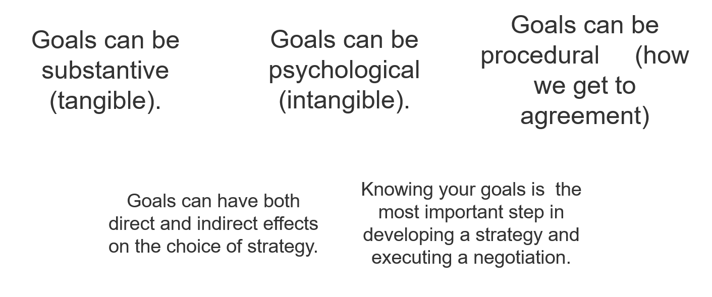
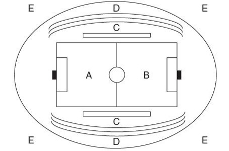

<!--

author:   Dr. Mark Jacob
email:
version:  0.0.1
language: en
narrator: UK English Female
comment: The Language of Negotiation 04
icon: ./img/TUBAF_Logo_orig_RGB.jpg

-->

[](https://liascript.github.io/course/?https://github.com/markjjacob/Negotiation/blob/main/TLON_Lecture_04.md)

# The Language of Negotiation - Strategy and Planning

> With effective planning and goal setting, most negotiators can achieve their objectives. Without them, results occur more by chance than by effort.

```` ascii

.-------.   .----------.   .----------.
| Goals +-->| Strategy +-->| Planning |
'-------'   '----------'   '----------'

````

> Although the model suggests a linear relationship, many begin midway in the sequence and work backward or forward until the steps are aligned.

## Goals - The focus that drives a negotiation strategy

To determine your goals, consider the following:

- Substantive goals - money
- Intangible goals - winning
- Procedural goals - shaping the agenda

Effective preparation requires negotiators do the following:

- List all goals they wish to achieve.
- Determine the priority among these goals.
- Identify potential multi-goal packages.
- Evaluate possible trade-offs among multiple goals

## Direct effects of goals on choice of strategy

Wishes are not goals, especially in negotiation.

A negotiator’s goals may be linked to the other party’s goals.

There are limits to what realistic goals can be.

Effective goals must be concrete, specific, and measurable.

- If not, it will be hard to communicate what you want, understand what the other party wants, and determine if an offer satisfies your goals.

> Goals can be intangible or procedural.
> 
> - Intangible goals might include maintaining a reputation, or establishing a precedent.
> 
> - A procedural goal might be that the other negotiator must make at least two concessions to convince you of their sincerity.

>> Criteria used to determine goals depend on your objectives and your priorities among multiple goals.

## Indirect effect of goals on choice of strategy

Short-term thinking affects our choice of strategy.
We may ignore the present or future relationship with the other party in a concern for achieving a substantive outcome only.

Goals requiring a substantial change in the other party’s attitude may require a long-range plan.

- Progress may be incremental and require a strong relationship with the other party.
- Relationship-oriented goals should motive the negotiator toward a strategy valuing the relationship as much as the outcome.

>> Relational goals tend to support the choice of a collaborative or integrative strategy.

## Strategy versus tactics

How are strategy and tactics related?

- One major difference is that of scale, perspective, or immediacy.

  - Tactics are short-term, adaptive moves designed to enact broad strategies.
  - Which in turn, provide stability, continuity, and direction for tactical behaviors.
  - Tactics are subordinated to strategy. They are structured, directed, and driven by strategic considerations.

## Accomodation, Competition and Collaboration

Accommodation is as much a win-lose strategy as competition.

- The imbalance is in the opposite direction – I lose, you win.
- Used to build or strengthen a relationship.

  - They expect a future “tit for tat” accommodation from the other.
  - Reciprocity may be the glue holding social groups together.
  - For a long-term relationship, consider accommodative moves early to build trust and to be able to ask for “reciprocity” in the future.

## Characteristics of different engagement strategies


## Drawbacks: Accommodation, Competition and Collaboration

Consequences if applied blindly, thoughtlessly, or inflexibly.

- Distributive strategies create “we-they” patterns, leading to the following.

  - Distortions in judgment about the other’s contributions and efforts.
  - Distortions in perceptions of the other’s motives, needs, positions.

- Integrative negotiators may be taken advantage of.

  - They may forget constituencies in favor of the process for its own sake.

- Accommodative strategies set a pattern of avoiding conflict.

  - A precedent that is hard to break.
  - Efforts to restore balance may be met with resentment.

Remember, it is difficult to follow any “pure” strategy.

## Getting ready to implement the strategy: The planning process

1. Define the negotiating goal.
2. Define the major issues related to achieving the goal.
3. Assemble the issues, ranking their importance, and define the bargaining mix.
4. Define the interests.
5. Know your alternatives (BATNAs).
6. Know your limits, including a resistance point.
7. Analyze and understand the other’s goals, issues, and resistance points.
8. Set your own targets and opening bids.
9. Assess the social context of the negotiation.
10. Present the issues to the other party – substance and process.

Assumptions.

- One process can be used for both distributive and integrative.
- Factors beyond the table may affect strategizing.
- Negotiations will be one-to-one.
- The steps are linear.

### Step 1: Defining the negotiating goal



### Assembling the issues, ranking their importance and defining the bargaining mix

> Assemble all the issues into a comprehensive list.
> 
> The combination of lists from both sides is the bargaining mix

Prioritization includes two steps.

- Determine which issues are most important and which less important.

  - A simple way is to use rank-order or group issues into categories.
  - Another way is to weight issues by importance.
  - Set priorities for both tangible and intangible issues.
  - Specify a bargaining range for each issue in the mix.

- Determine whether the issues are linked or separate.

  - If separate, they can be easily added or subtracted.
  - If connected, settlement on one is linked to settlement on the others.

### Step 4: Defining the interests

Positions are what a negotiator wants – interests are why they want them.

- Asking “why” questions helps surface values, needs, or principles.
- Like goals, interests may be:
  - Substantive – directly related to the focal issues under negotiation.
  - Process-based – related to how the negotiators behave.
  - Relationship-based – tied to the current or desired future relationship.

- Interests may also be based on intangibles of negotiation.
- Surfacing interests may be essential to understanding another side’s position.

### Step 5: Knowing your alternatives (BATNAs)

> Good preparation requires you establish two clear points:
> 
> - Your alternatives if this deal cannot be successfully completed.
> - And your limits - the least acceptible offer that you will still agree to.

BATNAs are other agreements negotiators could achieve and still meet their needs.

- Alternatives are very important because they define whether the current outcome is better than another possibility.
- The better the alternatives, the more power you have to walk away from the current deal and still have your needs and interests met.

### Step 6: Knowing your limits, including a resistance point

A resistance point is where you stop negotiations as any settlement beyond this point is not minimally acceptable.

- A seller’s resistance point is the least they will take for an item.
- A buyer’s resistance point is the most they will pay for an item.

Clear resistance points help keep people from agreeing to deals that they later realize weren’t very smart.

### Analyzing and understanding the other party's goals, issues and resistance points

> Find a way to see the negotiation from the other party’s eyes.
> 
> The goal is to understand their approach to the negotiation and what they are likely to want – then compare against your own.

- Attempt to understand if the other party has the same goals as you.
- The more you learn about the other party’s issues, and what they bring to the table, the better you can predict how the likely process.
- Get information about their current interests and needs through discussion, anticipating, asking, or researching.
- Understand the other party’s limits to give you an idea of how far you can “push” them.

In distributive negotiation, the other party may not disclose information and/or misrepresent their limits and alternatives in order to pressure you into a deal that is better for them.

### Setting one's own targets and opening bids

There are many ways to set a target but keep these principles in mind.

- Targets should be specific, difficult but achievable, and verifiable.
- Target setting requires proactive thinking about your own objectives.
- Target setting may require considering how to package several issues and objectives.
- Target setting requires an understanding of trade-offs and throwaways.

> Similarly, there are numerous ways to set an initial asking price.
> 
> - It may be the best possible outcome, an ideal solution, something even better than was achieved last time.
> - It is easy to get overly confident and set an opening so unrealistic that the other party laughs, gets angry, or walks away before responding.

### Step 9: Assessing the social context of a negotiation

When people negotiate in a professional context, there may be more than two parties.

- There may be more than two negotiators at the table.

  - Multiple parties often lead to the formation of coalitions.

- Negotiators may also have constituents who will evaluate and critique them.

  - There may be observers who watch and critique the negotiation.

- Negotiation occurs in a context of rules.

  - A social system of laws, customs, common business practices, cultural norms, and political cross-pressures.

> One way to assess all the key parties in a negotiation is to complete a “field analysis.”
> 
> Imagine you are the captain of a soccer team, envision the field and assess all the parties who are in the soccer stadium.



### Step 10: Presenting issues to the other party - Substance and process

Presenting and Framing the Issues.

- Consider how you will present your case to the other negotiator.

  - What facts support my point of view?
  - How can I present the facts so they are most convincing?

Planning the Process and Structuring the Context.

- What agenda should we follow?

  - Consider scope, sequence, framing, packaging, and formula.

- Where should we negotiate?
- What is the time period of the negotiation?
- What might be done if negotiation fails?
- How will we keep track of what is agreed to?
- Have we created a mechanism for modifying the deal if necessary?

### Preparation sheet

??[prep sheet](https://www.mwi.org/wp-content/uploads/2017/01/mwi-negotiation-prep-sheet.pdf)
