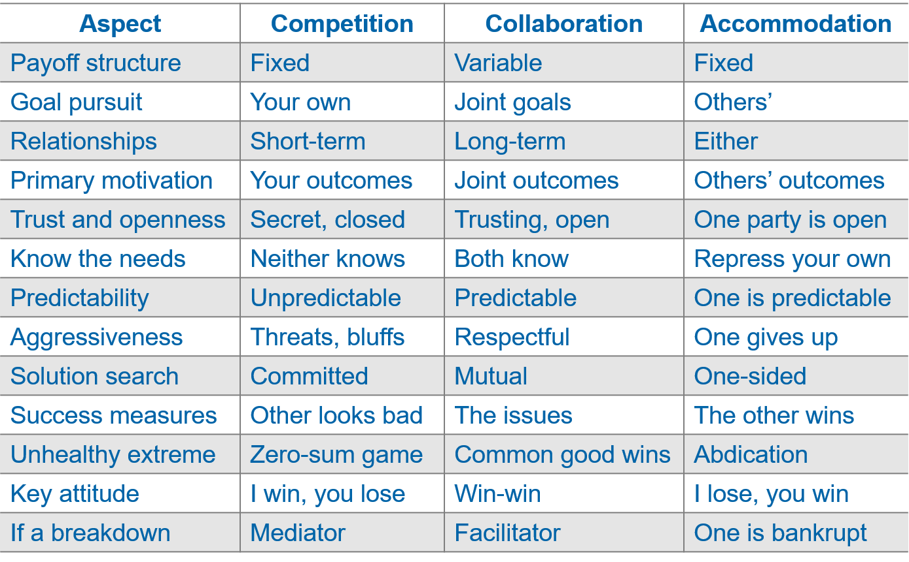

<!--

author:   Dr. Mark Jacob
email:
version:  0.0.1
language: en
narrator: UK English Female
comment: The Language of Negotiation 04
icon: ./img/TUBAF_Logo_orig_RGB.jpg

-->

[](https://liascript.github.io/course/?https://github.com/markjjacob/Negotiation/blob/main/TLON_Lecture_04.md)

# The Language of Negotiation - Strategy and Planning

> With effective planning and goal setting, most negotiators can achieve their objectives. Without them, results occur more by chance than by effort.

```` ascii

.-------.   .----------.   .----------.
| Goals +-->| Strategy +-->| Planning |
'-------'   '----------'   '----------'

````

> Although the model suggests a linear relationship, many begin midway in the sequence and work backward or forward until the steps are aligned.

## Goals - The focus that drives a negotiation strategy

To determine your goals, consider the following:

- Substantive goals - money
- Intangible goals - winning
- Procedural goals - shaping the agenda

Effective preparation requires negotiators do the following:

- List all goals they wish to achieve.
- Determine the priority among these goals.
- Identify potential multi-goal packages.
- Evaluate possible trade-offs among multiple goals

## Direct effects of goals on choice of strategy

Wishes are not goals, especially in negotiation.

A negotiator’s goals may be linked to the other party’s goals.

There are limits to what realistic goals can be.

Effective goals must be concrete, specific, and measurable.

- If not, it will be hard to communicate what you want, understand what the other party wants, and determine if an offer satisfies your goals.

> Goals can be intangible or procedural.
> 
> - Intangible goals might include maintaining a reputation, or establishing a precedent.
> 
> - A procedural goal might be that the other negotiator must make at least two concessions to convince you of their sincerity.

>> Criteria used to determine goals depend on your objectives and your priorities among multiple goals.

## Indirect effect of goals on choice of strategy

Short-term thinking affects our choice of strategy.
We may ignore the present or future relationship with the other party in a concern for achieving a substantive outcome only.

Goals requiring a substantial change in the other party’s attitude may require a long-range plan.

- Progress may be incremental and require a strong relationship with the other party.
- Relationship-oriented goals should motive the negotiator toward a strategy valuing the relationship as much as the outcome.

>> Relational goals tend to support the choice of a collaborative or integrative strategy.

## Strategy versus tactics

How are strategy and tactics related?

- One major difference is that of scale, perspective, or immediacy.

  - Tactics are short-term, adaptive moves designed to enact broad strategies.
  - Which in turn, provide stability, continuity, and direction for tactical behaviors.
  - Tactics are subordinated to strategy. They are structured, directed, and driven by strategic considerations.

## Accomodation, Competition and Collaboration

Accommodation is as much a win-lose strategy as competition.

- The imbalance is in the opposite direction – I lose, you win.
- Used to build or strengthen a relationship.

  - They expect a future “tit for tat” accommodation from the other.
  - Reciprocity may be the glue holding social groups together.
  - For a long-term relationship, consider accommodative moves early to build trust and to be able to ask for “reciprocity” in the future.

## Characteristics of different engagement strategies



## Drawbacks: Accommodation, Competition and Collaboration

Consequences if applied blindly, thoughtlessly, or inflexibly.

- Distributive strategies create “we-they” patterns, leading to the following.

  - Distortions in judgment about the other’s contributions and efforts.
  - Distortions in perceptions of the other’s motives, needs, positions.

- Integrative negotiators may be taken advantage of.

  - They may forget constituencies in favor of the process for its own sake.

- Accommodative strategies set a pattern of avoiding conflict.

  - A precedent that is hard to break.
  - Efforts to restore balance may be met with resentment.

Remember, it is difficult to follow any “pure” strategy.

## Geating ready to implement the strategy: The planning process

1. Define the negotiating goal.
2. Define the major issues related to achieving the goal.
3. Assemble the issues, ranking their importance, and define the bargaining mix.
4. Define the interests.
5. Know your alternatives (BATNAs).
6. Know your limits, including a resistance point.
7. Analyze and understand the other’s goals, issues, and resistance points.
8. Set your own targets and opening bids.
9. Assess the social context of the negotiation.
10. Present the issues to the other party – substance and process.

Assumptions.

- One process can be used for both distributive and integrative.
- Factors beyond the table may affect strategizing.
- Negotiations will be one-to-one.
- The steps are linear.

### Step 1: Defining the negotiating goal


