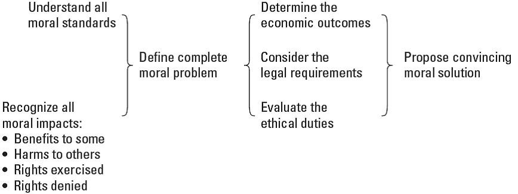
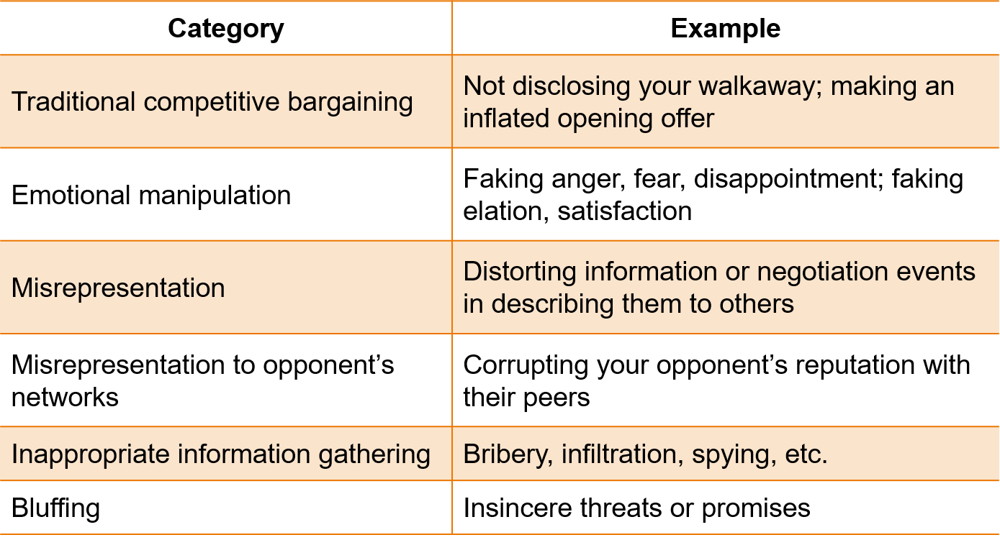

<!--

author:   Dr. Mark Jacob
email:
version:  0.0.1
language: en
narrator: UK English Female
comment: The Language of Negotiation 05
icon: ./img/WBM_orig_RGB.jpg

-->

# The Language of Negotiation - Ethics

## Is this ethical?

1. You are selling your e-bike to raise money for an upcoming trip overseas.

-	Is it ethical to say you have another offer, when there is no other offer?

2. To gain inside knowledge of a competitor’s business, you have a consultant call and ask about problems or threats in the company.

-	Is this an ethical way to learn about the competitor’s company?

3. When selling your laptop, you decide not to tell buyers the computer crashes without warning.

-	Is this ethical?  Would you be likely to do this?

4. You buy a new pair of shoes on sale (no returns) but you make a scene in the store and the manager refunds your money.

-	Is this ethical?  Would you be likely to do this?

Is this ethical?

    [[Ethical][Unethical][Would][Wouldn't]]
    [                                         ] e-bike
    [                                         ] competitor
    [                                         ] laptop
    [                                         ] shoes

### Ethics defined

Ethics are broadly applied social standards for what is right or wrong in a particular situation, or a process for setting those standards.

-	Differ from morals, which are individual and personal beliefs.

??[morals vs ethics](https://www.britannica.com/story/whats-the-difference-between-morality-and-ethics)

Choose a course of action on the basis of results, duty, community norms, or personal convictions.

**End-result ethics**

- the rightness of an action is determined by evaluating the pros and cons of its consequences.

**Duty ethics**

- the rightness of an action is determined by an obligation to adhere to principles, laws, and social standards that define what is right and wrong and where the line is.

**Social contract ethics**

- the rightness of an action is based on the customs and norms of a particular community.

**Personalistic ethics**

- the rightness of the action is based on one’s own conscience and moral standards.

### Applying ehtical reasoning to negotiation

Using the situation from the start of the chapter involving selling an e-bike and the statement to a prospective buyer about the existance of another potential buyer.

> If you believe in **end-result** ethics, then you might do whatever is necessary to get the best possible outcome (including lie).

> If you believe in **duty** ethics, you might perceive an obligation never to engage in subterfuge and might reject a tactic that involves an outright lie.

> In **social contract** ethics, you base your tactics on appropriate conduct in your community; if others would use deception in a situation like this, you will too.

> In **personalistic** ethics, your conscience decides if your need for cash for your upcoming trip justifies using deceptive or dishonest tactics.

### Ethics v. Prudence v. Practicality v. Legality

Ethical.

- Appropriate as determined by some standard of moral conduct.

Prudent.

- Wise, based on trying to understand the efficiency of the tactic and the consequences it might have on the relationship with the other.

Practical.

- What a negotiator can actually make happen in a given situation.

Legal. 

- What the law defines as acceptable practice.

### Figure 5.1: Analytical Process for the Resolution of Moral Problems

> This model presents a helpful way to think about what it means to comprehend and analyze an ethical dilemma.

    --{{0}}--
The first step is developing a complete understanding of the moral problem at hand.
•	This means grasping the various subjective moral standards in play among involved parties, including individual values and beliefs as well as social norms.
•	It also means recognizing the mix of potential harms, benefits, and rights that are involved in the situation.
With the problem fully defined, the path to a convincing solutions travels through the three modes of analysis shown on the right side of the figure.
•	A determination of economic outcomes of potential courses of action.
•	A consideration of legal requirements that bear on the situation.
•	An assessment of the ethical obligations to other involved parties regarding what is “right” and “just” and “fair.”
The result from this process is to propose a convincing moral solution.

## Ethical conduct in negotiation

Why do some negotiators use unethical tactics?

-	The first answer – immoral – may be too simplistic.

-	People regard other people’s unsavory behavior as due to personality and attribute their own behavior to factors in the social environment.

-	A negotiator might consider an opponent’s use of an ethically questionable tactic as unprincipled.

-	In contrast, if the negotiator uses the same tactic themselves, they tend to say they have a good reason for deviating from principles, this one time.

The following section discusses negotiation tactics that bring issues of ethicality into play.

### Ethically ambiguous tactics and truth

Ethically ambiguous tactics may or may not be improper, depending on an individual’s ethical reasoning and circumstances.

-	Questions about truth telling are clear, but not the answers.

-	How do you define truth?  How do you define deviations from the truth?

Effective agreements depend on sharing accurate information but negotiators want to disclose little about their positions.

> -	The dilemma of trust is that a negotiator who believes everything the other says can be manipulated by dishonesty.
>
> -	The dilemma of honesty is that a negotiator who tells the other party all their requirements will never do better than their walkaway point.

### Table 5.2: Categories of marginally ethical negotiating tactics

Sources: Adapted from Robert J. Robinson, Roy J. Lewicki, and Eileen M. Donahue, “Extending and Testing a Five Factor Model of Ethical and Unethical Bargaining Tactics: The SINS Scale,” Journal of Organizational Behavior 21 (2000), pp. 649–64; and Ingrid S. Fulmer, Bruce Barry, and D. Adam Long, “Lying and Smiling: Informational and Emotional Deception in negotiation,” Journal of Business Ethics 88 (2009), pp. 691–709

### Is it acceptible to use ethically ambiguous tactics?

Acceptible?

[(Yes)] Yes
[(No)] No
[(Fence)] Fence

> There are tacitly agreed-on rules of the game in negotiation.
> 
> - Some minor forms of untruths may be seen as ethically acceptable and within the rules.
> 
> - In contrast, outright deception is generally seen as outside the rules.

The authors offer some caution.

-	Statements are based on large groups of people and do not indicate or predict any individual negotiator’s use of such tactics.

-	Observations are based on what people said they would do, rather than what they actually did.

-	By reporting the results, the authors do not endorse the use of marginally ethical tactics.

-	This is a Western view of negotiation, not true for other cultures – “let the buyer beware” at all times.

### Deception by omission versus commission

The use of deceptive tactics can be active or passive.

For example, misrepresenting your interest on a common-value issue in order to obtain a future concession from the other party.

> Negotiators use two forms of deception in misrepresenting the common-value issue:
> 
> - Misrepresentation by omission – failing to disclose information that would benefit the other party.
> 
> - Misrepresentation by commission – actually lying about the issue.

> A student role-play study involving the sale of a car with a defective transmission revealed the following insight.
> 
> - Students could lie by omission or commission.
> 
> - Far more students were willing to lie by omission.

### Figure 5.2: A simple model of deception in negotiation

    --{{0}}--
This flowchart model describes a rational calculation process in which the negotiator selects a tactic, uses the tactic, evaluates the consequences, and attempts to manage the consequences (if the tactic is detected) through explanations and justifications.
The model puts a negotiator in an influence situation and identifies possible influence tactics that could be effective, some of which might be deceptive, inappropriate, or marginally ethical.
Once identified, the negotiator may decide to use one or more tactics – the selection and use are likely influenced by the negotiator’s own motivations and their judgment of the tactic’s appropriateness.
Once the tactic is employed, the negotiator will assess consequences on three standards: whether the tactic worked and produced the desired result; how the negotiator feels about themselves after using the tactic; and how the individual may be judged by the other party or by neutral observers.
Negative or positive conclusions on any of these three standards may lead the negotiator to try to explain or justify use of the tactic, and they will eventually affect a decision to employ similar tactics in the future.

## Why use deceptive tactics? Motives and consequences

### Motives for using deceptive tactics

Negotiators use ethically ambiguous tactics to increase their power.

- Whoever has better information “wins” the negotiation.

  - This view assumes that the information is accurate and truthful.

  - Questioning the other’s truthfulness may insult them and investigating their truthfulness consumes time and energy.

- If deception is a way to gain power, then are negotiators in a position of weakness more likely to be tempted to engage in deception?

> A negotiator’s motivation affects their tendency to use deception.
> 
> - They may use it to achieve their goals.
> 
> - They may use it to avoid being exploited.
> 
> - Individual differences of personality or culture affect its use.
> 
> - Negotiators rationalize deception in anticipation of the other’s conduct.

### Consequences of unethical conduct

Deceptive tactics are effective in certain circumstances.
Consequences occur whether the tactic worked or not.

> Effectiveness.
> 
> - Deceptive tactics are effective in certain circumstances.
> 
> - Consequences occur whether the tactic worked or not.

> Reactions of others.
> 
> - “Targets” are typically angry and now mistrust you. They may seek revenge.
>   
> - For serious and personal deception, the relationship suffers. Damage to your reputation can be difficult to repair.

> Reactions of self.
> - When the other party suffers, a negotiator may feel discomfort.
> 
> - Negotiators who have no problem using deceptive tactics may use them again and ponder how to use them more effectively.

### Explanations and justifications

Here are some typical examples.

- *The tactic was unavoidable* – so the negotiator is not responsible.
- *The tactic was harmless* – according to the deceptive party.
- *The tactic will help to avoid negative consequences* – for who?
- *The tactic will produce good consequences, or altruistically motivated.*
- *“They had it coming,”* or *“They deserve it,”* or *“I’m getting my due.”*
- They were going to do it anyway, so I will do it first – anticipation.
- *“He started it”* – anticipation in the past tense.
- *The tactic is fair or appropriate to the situation* – ethical relativism.

> Explanations allow the negotiator to convince others – particularly the victim – that conduct is acceptable.
> 
> They also help rationalize the behavior to themselves.

## Dealing with others' use of deception

Ask probing questions to reveal a great deal of information.

Rephrase questions to uncover answers which skirt the truth.

Force the other party to lie to your face or back off.

Test the other party by asking a question you already know the answer to, and note the response.

“Call” the tactic, and indicate your displeasure.

Ignore the tactic for a relatively minor aspect.

Discuss and help the other party shift to more honest behavior.

Responding in kind will escalate the conflict.

