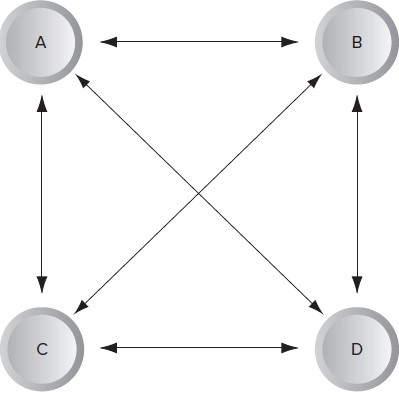
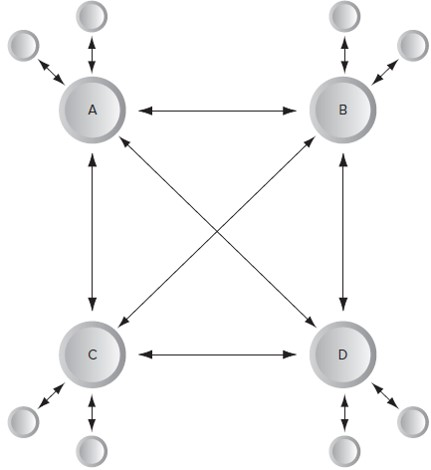
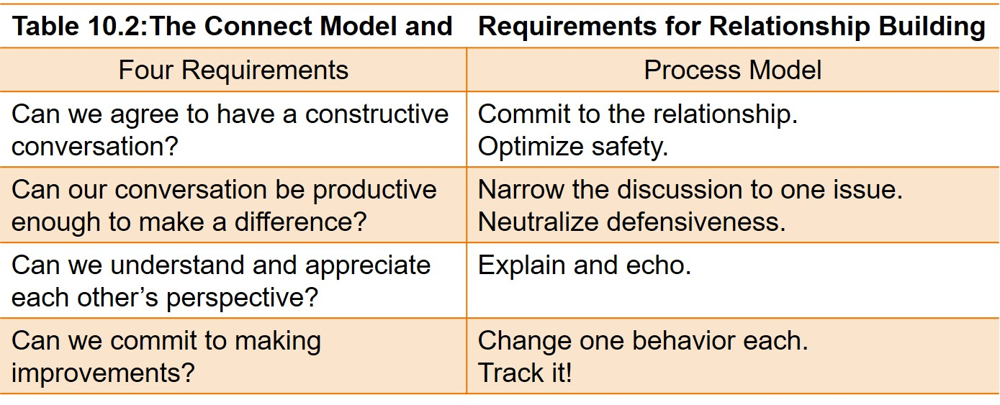

<!--

author:   Dr. Mark Jacob
email:
version:  0.0.1
language: en
narrator: UK English Female
comment: The Language of Negotiation 09
icon: ./img/WBM_orig_RGB.jpg

-->

# The Language of Negotiation - Multiple Parties, Groups and Teams

## The Nature of Multiparty Negotiations

{{0}}
A *multiparty negotiation* is one in which more than two interested parties are working together at the table to achieve a collective objective.

### Four Friends and a Smart TV

??

#### The Issue

{{0-2}}

{{1-2}}
Click [here](https://www.mediamarkt.de/de/product/_samsung-gq65q60a-2724135.html?storeId=&utm_source=google&utm_medium=cpc&utm_campaign=RT_shopping_na_nsp_na_PLA+-+LIA+-+PMax+Test&gclid=EAIaIQobChMItZ69oJG8-AIV2IBQBh1jEAGFEAQYAiABEgKnLPD_BwE&gclsrc=aw.ds) for more details.

{{2}}
A group of four students are selling a selling an LED Smart TV and puts up notices on WhatsApp and Instagram.

{{3}}
A year ago each put in €200 to buy the TV: Now they have different preferences for what they should do with it.

#### The students

{{0-2}}

{{1-2}}
 - Aadhunika, A, wants to sell it and simply split the money because she wants to buy herself a new smartphone
 - Brisa, B, wants to sell it and buy a smaller, less expensive TV so she can watch his own shows
 - Constantin wants to sell it and buy a big screen TV and top quality audio system that will require each of them to chip in a lot more money
 - Daniel, D, doesn't want to sell it at all and thinks the whole thing is a dumb idea

{{2}}

{{3}}

### Differences between Two-Party Negotiations and Multiparty Negotiations

Number of parties.

- Social roles may change the power and status during talks.

Informational and computational complexity.

- Tracking solution boundaries is a challenge.

Social complexity.

- Small group dynamics affect negotiator behavior.

Procedural complexity.

- Discussing multiple issues at the same time leads to better agreements.

Logistical complexity.

- Facilitate integrative agreement by bringing parties physically close—interpret if needed.

Strategic complexity.

- Dealing with each strategy may:

  - Lead to distributive tactics.
  - Strategic control of party numbers.
  - Lead to coalition building.
    - “snowball” coalitions.

- Past or future relations may shape current discussions.

### What Dynamics Can Make a Multiparty Negotiation Effective?

- *Test assumptions* and inferences.
- *Share* as much relevant information as possible.
- *Focus on interests*, not positions.
- *Explain the reasons* behind your statements, questions, and answers.
- *Be specific*—use examples.
- *Agree on the meaning* of important words.
- *Disagree openly* with any member of the group.
- *Make statements*; then invite questions and comments.
- *Jointly design* ways to test disagreements and solutions.
- *Discuss* undiscussable issues.
- Keep the *discussion focused*.
- *Do not take cheap shots* or create irrelevant sidetracks or otherwise distract the group.
- *Expect to have all members participate* in all phases of the process.
- *Exchange relevant information* with parties not at the table.
- *Make decisions by consensus*.
- *Conduct a self-critique*.

## Managing Multiparty Negotiations

There are three key stages to manage:

- the prenegotiation stage,
- the actual negotiations,
- and the agreement stage.

In the next section we address these three stages and identify what a single negotiator can do in the following situations.

- They want to ensure their own issues and interests are clearly incorporated into the final agreement.
- They want to ensure the group reaches the highest-quality and best possible final agreement.
- They are responsible for overseeing a multiparty negotiation process to ensure that many of the strategic and procedural complexities are effectively managed.

### The Prenegotiation Stage

This stage is characterized by a lot of informal contact among the parties.

> Parties work on a number of important issues.
>
>- Who is at the table.
>- Whether coalitions can be formed.
>- What member roles different parties will take.
>- Understanding the consequences of no agreement.
>- And constructing an agenda

#### Prenegotiation Stage—Identify Participants

> Parties must agree on who is invited to the talks, which may take time with complex negotiations.

Participants can be decided on the basis of any of the following:

- Who must be included if a deal is to be reached? 
- Who could spoil the deal if they are excluded?  
- Whose presence is likely to help other parties achieve their objectives?
- Whose presence is likely to keep other parties from achieving their objectives?
- Whose status will be enhanced simply by being at the table?

#### Prenegotiation Stage—Coalitions and Roles

Coalitions may form before negotiations begin or during negotiations.
Coalitions may form to promote or block a particular agenda item.

> There are three types of roles members play.
>
>- Task roles move the group toward conclusion.
>
>  - Initiating/offering, information seeking, opinion seeking, elaborating, evaluating, coordinating, and energizing.
>
>- Relationship roles sustain good relationships.
>
>  - Encouraging, harmonizing, compromising, gatekeeping, and standard setting.
>
>- Self-oriented roles bring attention to an individual, often at the expense of others.
>
>  - Blocking, recognition seeking, dominating, and avoiding.

#### Prenegotiation Stage—Costs No Agreement

> In one-on-one encounters, a BATNA is important during impasse.
>
>- But what if a group of equals is assigned a decision and there is no agreement—who decides?

Are the costs the same for every negotiator?

- Different agents have different costs associated with no agreement.
- Members with a BATNA are likely to have more power.

Do all parties perceive their agreement and no-agreement options accurately?

- In multiparty negotiations, perceptual biases likely affect negotiators by inflating their sense of power and ability to win.
- This may lead them to believe that the no-agreement alternative is much better than it really is.
- Reality checking with others is important to keep biases under control.

#### Prenegotiation Stage—Issues and Agenda

There are many reasons why an agenda can be an effective decision aid.

- It establishes the issues that will be discussed.
- Depending on how the issues are worded, it can also define how each issue is discussed.
- It can define the order in which issues are discussed.
- It can be used to introduce process issues as well as substantive issues, simply by including them.
- It can assign time limits to various items, thereby indicating the importance of the various issues.

#### Prenegotiation Stage—The Connect Model

In addition to creating an agenda, parties might also agree to abide by a set of ground rules—ways to conduct themselves during the negation.

- The Connect Model is a proven approach to building effective group relationships.

## Formal Stage

### Formal Stage—Appoint an Appropriate Chair

Multiparty negotiations benefit  from a neutral chairperson, implementing the following tactics.

- Explicitly describe your role.
- Introduce an agenda based on issues, concerns, priorities.
- Make logistical arrangements.
- Introduce ground rules.
- Create or review decision standards and rules.

- Assure members they will have opportunity to speak and get their issues on the table.
- e an active gatekeeper.
- Listen for interests and commonalities.
- Introduce external information that will illuminate the issues.
- Summarize frequently.
  - Particularly when stalled, confused, or tense

#### Formal Stage—Use and Restructure the Agenda

An agenda is critical to controlling the flow and direction of negotiations.

- Introduced and coordinated either by the chair or by the parties.
- Provides low-power groups a way of getting their issues addressed

> How an agenda is built, and who builds it, will greatly impact negotiation flow.
>
> - Negotiators facing an unacceptable preemptive agenda should let others know they consider the agenda open to discussion.
> - In other words, make sure that agenda modifications are part of the agenda.

> Agendas may artificially partition related issues.
>
> - Be willing to challenge and reconfigure an agenda if it leads to an integrative agreement.

#### Formal Stage—Diversity of Information and Perspectives

A third way to facilitate the negotiation is to ensure the parties receive a variety of perspectives about the task and sources of information.

- The nature of information changes depending on the task.
- The chair should ensure that input is received from everyone and that relevant data is circulated and discussed.

> Five key steps a chair can implement to ensure having an effective, amicable disagreement on a team.

>- Collect your thoughts and composure before speaking.
>- Try to understand the other person’s position. 
>- Try to think of ways that you both can win.
>- Consider how important this issue is to you. 
>- Remember that you will probably have to work together with these people in the future.

#### Formal Stage—Consider All Available Information

Parties seldom consider what discussion norms they are going to follow and there are several things that can undermine an effective discussion.

- Unwillingness to tolerate conflicting points of view and perspectives.
- Side conversations.
- No means for defusing an emotionally charged discussion.
- Coming to a meeting unprepared.

> Strategies may manage these potentially destructive discussion norms.
>
> - The *Delphi Technique*.
>
>  - A moderator sends a questionnaire to all parties, asking for input.
>
> - *Brainstorming*.
>
>  - Parties define a problem and generate as many solutions as possible without criticizing any of them.
>
> - *Nominal Group Technique* evaluates brainstormed solutions

#### Formal Stage—Manage Conflict Effectively

The parties must generate many ideas and approaches to a problem—which usually creates conflict.

- When done well, conflict is a natural part of the decision-making process.
- When done poorly, conflict actively disrupts all processes.

One study examined three kinds of conflict typical to work groups.

- Relationship conflict—interpersonal incompatibilities.
- Task conflicts—differences in viewpoints about the group’s task.
- Process conflicts—conflict on how task accomplishment will proceed.

High-performing groups had the following characteristics.

- Low, but increasing levels of process conflict.
- Low levels of relationship conflict with a rise near the deadline.
- A moderate level of task conflict at the midpoint.

#### Formal Stage—Decision Rules

Decision rules must be managed—how the group will decide what to do.

- Decisions can be made by dictatorship—one person decides.
- By oligarchy—a dominant minority coalition decides.
- Simple majority—one more person than half decides.
- Two-thirds majority.
- Quasi-consensus—most of the parties agree, and those who dissent agree not to protest or raise objections.
- True unanimity.
- Consensus—everyone agrees.

> Determining decision rules before talks start significantly affects the process.
>
> - If simple majority rules, coalitions may form before deliberations.
> - If consensus is the rule, the group must work hard to reach agreement.

#### Formal Stage—First Agreement

> If the objective is consensus or the best quality solution, negotiators should not strive to achieve it all at once.
> 
> - Instead, strive for a first agreement, then revise, upgrade, improve.
> - Under multiparty conditions, achieving true consensus becomes more difficult, even if a true consensus solution exists.
> - It is often better to set a more modest objective: to reach a preliminary agreement or a tentative consensus.

The drawback is that many parties may be satisfied with the first solution.

- Resistance to further deliberations may be overcome by taking a break, encouraging the parties to critique and evaluate the agreement.

  - With plans to come back for second-agreement negotiations (renegotiations).

#### Formal Stage—Problematic Behaviors

Individual behaviors may create difficulty in achieving an effective group—arriving late, coming unprepared, and causing distractions.

- Here are a number of tactics for dealing with problematic behavior.

  - Be specific about the problem behavior—offer clear examples.
  - Phrase the problem as one that is affecting the entire team, rather than just you—use “we” instead of “you” to avoid defensiveness. 
  - Focus on behaviors the other can control. 
  - Wait to give constructive criticism until the individual can truly hear and accept it.
  - Keep feedback professional. Use a civil tone and describe the offending behavior and its impact specifically. 
  - Make sure the other has heard and understood your comments.

### The Agreement Stage

Parties choose an alternative and four key problem-solving steps occur.

- *Select the best solution.*

  - The fairness of the solution should be one of the primary criteria for selecting this package.

- *Develop an action plan.*

  - This increases the likelihood a solution will be implemented completely, effectively, and on time

- *Implement the action plan.*

  - This is likely to take place after the group disbands but it needs to follow the established guidelines.

- *Evaluate outcomes and the process.*

  - Evaluation of the process and outcome can be critical for surfacing data about the effectiveness of the process followed.

#### Agreement Stage—What the Chair Can Do to Help

*Move the group toward selecting one or more of the options.*

- Use the process rules to reach an integrative agreement.
- Permit and encourage packaging and trade-offs.

*Shape and draft the tentative agreement.*

- Write it down, work on language, display and edit freely.

*Discuss whatever implementation and follow-up steps need to occur.*

- Make assignments to ensure key action steps are executed.

*Thank the group for their participation, their hard work, and their efforts.*

- A celebration and formal thank-you notes or gifts may be in order.

*Organize and facilitate the postmortem.*

- Bring the parties back to discuss the process and outcome and to evaluate what might have been done better or differently the next time.

