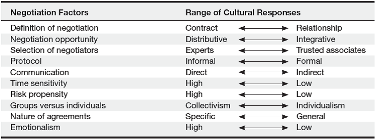

<!--

author:   Dr. Mark Jacob
email:
version:  0.0.1
language: en
narrator: UK English Female
comment: The Language of Negotiation 11
icon: ./img/WBM_orig_RGB.jpg

-->

# The Language of Negotiation - International and Cross-Cultural Negotiation

## What Makes International Negotiation Different?

There are two contexts with an influence on international negotiations.

- The environmental context including environmental forces that neither negotiator controls that influence the negotiation.
- The immediate context includes factors over which negotiators appear to have some control.

  - Understanding factors in both contexts is important to understanding the complexity of international negotiation processes and outcomes.

## Environmental Context—Political and Legal Pluralism

Firms conducting business in different countries are working with different legal and political systems.

- There may be implications for the taxes that an organization pays.
- The labor codes or standards that it must meet.
- And the different codes of contract law and standards of enforcement.

Political considerations may enhance or detract from the conduct of business negotiation in various countries at different times.

## Environmental Context—International Economics

> The exchange value of international currencies naturally fluctuates, and this factor must be considered when negotiating in different countries.

The risk is typically greater for the party who must pay in the other country’s currency.

- The less stable the currency, the greater the risk for both parties.
Any change in value of a currency (upward or downward) can significantly affect the value of the deal for both parties.

## Environmental Context—Foreign Governments and Bureaucracies

Countries differ in the extent to which the government regulates industries and organizations.

- Firms in the U.S. are relatively free from government intervention.

  - Although some industries are more heavily regulated than others (e.g. power generation, defense).
  - And some states have tougher environmental regulations than others.

> In general, business negotiations in the U.S. occur without government approval.

- The parties decide whether to engage in an agreement based on business reasons alone.
- In contrast, the governments of many countries supervise imports and joint ventures.

> Political considerations may influence negotiations more heavily than legitimate business reasons.

## Environmental Context—Instability 

North America is relatively stable. 

- But instability takes many forms.

  - A lack of resources that Americans commonly expect during business negotiations (paper, electricity, computers).
  - Shortages of other goods and services (food, reliable transportation, potable water).
  - Political instability (coups, sudden shifts in government policy, major currency revaluation).

Negotiators facing unstable circumstances should include clauses in their contracts allowing for easy cancellation or neutral arbitration and consider purchasing insurance to guarantee contract provisions.

## Environmental Context—Ideology

Negotiators in the U.S. generally share a common ideology about the benefits of individualism and capitalism and believe in the following.

- Individual rights.
- The superiority of private investment.
- The importance of making a profit in business.

Negotiators from other countries may not share this ideology.

- Negotiators from China or France may stress group rights over individual rights.
- They may stress public investment over private investment.
- They may have different views on earning and sharing profit.

> Ideological clashes increase communication challenges

## Environmental Context—Culture

Culture’s critical role will be discussed later, here are some highlights.

- People from different cultures appear to negotiate differently.
- Different cultures may interpret the negotiation process differently.
- People in some cultures approach negotiations deductively.

  - Whereas people from other cultures are more inductive.

-  some cultures, parties negotiate substantive issues while considering the relationship to be more or less incidental.

  - In other cultures, the relationship is the main focus of the negotiation, and the issues are more or less incidental.

- Preference for conflict resolutions models varies across cultures.

## Environmental Context—External Stakeholders

External stakeholders are the various people and organizations that have an interest or stake in the outcome of the negotiations.

- Business associations.
- Labor unions.
- Embassies.
- Industry associations, among others.

## Immediate Context—Relative Bargaining Power

Joint ventures have been studied, and relative power has been viewed as the amount of equity each side is willing to invest in the new venture.

- Presuming the party who invests more equity has more power and  more influence on the negotiation process and outcome.
- Some research suggests that relative power appears to be due to management control of the project, heavily influenced by negotiating.

> Several factors influence relative power.
>
>  - Special access to markets.
>  - Distribution systems.
>  - Management of government relations.

## Immediate Context—Levels of Conflict

> The level of conflict and type of interdependence between the parties will influence the negotiation process and outcome.

- High-conflict situations, or conflicts that are ethnically, identity, or geographically based, will be more difficult to resolve.
- Also important is the extent to which negotiators frame the negotiation differently or conceptualize what the negotiation concerns.

  - This varies across cultures.
  - How negotiators respond to conflict also varies by culture.

- Diplomatic “back-channel” negotiations conducted in secret may help resolve high conflict situations, but success is not guaranteed.

## Immediate Context—Relationships and Desired Outcomes

The relationships among principal negotiators before negotiations impact the negotiation process and outcome.

- Negotiators are part of the larger relationship between two parties.
- History between the parties influences current negotiations, just as the current negotiation will influence any future negotiations.

**Desired Outcomes.**

Tangible and intangible factors play a large role in determining the outcomes of international negotiations.

- Countries often use international negotiations to achieve both domestic and international political goals.
- Ongoing tension can exist between a party’s short-term objectives for current negotiations and its influence on their long-term relations.

## Immediate Context—Immediate Stakeholders

The immediate stakeholders in the negotiation include the negotiators themselves as well as the people they directly represent.

- Such as managers, employers, or boards of directors.

Stakeholders can influence negotiators in many ways.

- Negotiator skills, abilities, and experience can impact the process and outcome of international negotiations.
- Personal motivations of the principal negotiators and other immediate stakeholders can influence the negotiation process and outcomes.

## Conceptualizing Culture and Negotiation

There are many different meanings of the concept of culture, but all definitions share two important aspects.

- First, culture is a group-level phenomenon.

  - That means that a defined group of people share beliefs, values, and behavioral expectations.

- Second, cultural beliefs, values, and behavioral expectations are learned and passed on to new members of the group.

> Culture can be conceptualized in international negotiation in four ways.
>
> - As learned behavior.
> - As shared values.
> - As dialectic.
> - And in context.

## Culture as Learned Behavior

This approach concentrates on creating a catalogue of behaviors that the foreign negotiator should expect when entering a host culture.
Many books and articles provide lists of dos and don’ts.

- For instance, Chinese negotiators begin negotiations with a search for broad principles and building a relationship.
- This is followed by assessment of boundaries of the relationship.
- A decision about an agreement will eventually be made and form the foundation for further concessions and modifications.

## Culture as Shared Values

Hofstede’s Model of Cultural Dimensions.

Individualism/Collectivism.

- Short-term criteria versus long-term relationships.

Power Distance.

- Low power distance distributes decision-making, while high power distance seeks approval from those higher up.

Masculinity/Femininity

- Competitive versus empathy.

Uncertainty Avoidance.

- Low uncertainty avoiders adapt to change, others adapt less so.

A drawback of this model is that all studied participants came from one company, were mostly male, and highly educated.

## Culture as Dialectic

A dialectic is a tension illustrated by two common parables: “too many cooks spoil the broth” and “two heads are better than one.”

- This approach reminds you that not every person from the same culture share the same values.

- It does not provide simple advice for behaving in a negotiation.

Recent work examines negotiation metaphors.

- In the U.S. negotiation is sport.
- In Japan, negotiation is ie (traditional household).

The greater the difference in cultural negotiation metaphors, the more likely there will be misunderstanding, and less profitable outcomes.

> Negotiators with stronger understanding of the negotiation metaphor within a culture are more likely to succeed in negotiations.

## Culture in Context

Proponents of this approach recognize human behavior is not determined by a single cause.

- All behavior may be understood at many levels simultaneously.
- Negotiation is determined by many factors, one of which is culture.

The *cultural complexity theory* suggests that cultural values have a direct effect on negotiations at times and a moderate effect at other times.

- France has both monarchical and democratic traditions, both of which can influence negotiation behavior depending on the context.

One group of researchers noted the unwieldy number of constructs used to explore cross-culture differences in negotiation.

- They proposed a model that integrates negotiation strategy, trust, cultural tightness-looseness and mindset (holistic vs analytic).
- Their model is an excellent example of studying culture in context.

## The Influence of Culture on Negotiation: Managerial Perspectives

> Table 11.2 summarizes 10 different ways that culture can influence negotiations.

## Managerial Perspectives—Definition and Opportunity

> The fundamental definition of negotiation, what is negotiable, and what occurs when we negotiate can differ greatly across cultures.
> 
> - Americans tend to view negotiating as a competitive process of offers and counteroffers.
> 
> - While the Japanese tend to view the negotiation as an opportunity for information-sharing.

Culture influences the way negotiators perceive an opportunity as distributive versus integrative.

- Negotiators in North America are predisposed to perceive negotiation as distributive.
- This is not the case outside North America.

## Managerial Perspectives—Selection and Protocol

Criteria used to select who will participate differs across cultures and can include the following.

- Knowledge of the subject matter being negotiated.
- Seniority or even family connections.
- Gender, age, experience, or status.

Different cultures weigh the criteria to select negotiators differently.

Cultures differ in the degree to which protocol, or the formality of the relations between the two negotiating parties, is important.

- American culture is among the least formal in the world.

  - Familiar communication; first names are used, titles are ignored.

- In formal countries, not using the proper title is considered rude.
- Business cards are important in the Pacific Rim countries and they have their own protocol for presenting the cards.

## Managerial Perspectives—Communication and Time Sensitivity

Cultures influence how people communicate, verbally and nonverbally.

- Differences in body language across cultures make some behavior highly insulting in one culture and innocuous in another.

  - Placing your feet on the desk in the U.S. signals power, while in Thailand, it is considered very insulting.

- To avoid offending, the international negotiator needs to observe cultural rules of communication carefully.

Culture determines what time means and how it affects negotiation.

- In the U.S., people respect time by being on time, being sensitive to not wasting time, and believing that “faster” is better than “slower.”
- Other cultures have different views of time—especially in hot climates.

  - Arab-speaking cultures focus on event-time than clock-time.
  - In China and Latin America, time is unimportant and negotiations focus on the task, no matter how much time it takes.

## Managerial Perspectives—Risk Propensity and Groups versus Individuals

Cultures vary in the extent to which they are willing to take risks.

- Negotiators in risk-oriented cultures will be more willing to move early on a deal and will generally take more chances.
- Those in risk-avoiding cultures are more likely to seek further information and take a wait-and-see stance.

- Americans fall on the risk-taking end of the continuum, as do some Asian cultures, while some European cultures are conservative.

Cultures differ over whether they emphasize the individual or the group.

- The United States is very much an individual-oriented culture, where being independent and assertive is valued and praised.
- Group-oriented cultures, in contrast, favor the superiority of the group and see individual needs as second to the group’s needs.

  - Group-oriented cultures value fitting in and reward team players.

## Managerial Perspectives—Nature of Agreements and Emotionalism

Culture has an important effect both on concluding agreements and on what form the negotiated agreement takes.

- In the U.S., agreements are typically based on logic, are often formalized, and enforced through the legal system.
- In other cultures, obtaining the deal may be based on who you are rather than on what you can do.

Culture may influence the extent to which negotiators display emotions.

- Emotions may be used as tactics, or they may be a natural response to positive and negative circumstances during the negotiation.
- While personality likely plays a role in the expression of emotions, there also appears to be considerable cultural differences.
- The rules that govern general emotional displays in a culture are likely to be present during negotiation.

## The Influence of Culture on Negotiation: Research Perspectives

The last 20 years has seen an increase in research on cross-cultural negotiation, and has studied the following topics.

- The influence of culture on negotiation outcomes.
- Negotiation process and information exchange.
- Negotiator cognition.
- Negotiator ethics and tactics.
Conflict resolution.

## Effects of Culture on Negotiation Outcomes

Research uses two approaches when looking at how culture influences negotiation outcomes.

- Intracultural studies compare outcomes of the same simulation.

  - Negotiators from different cultures negotiating with others from their own culture.

- Cross-cultural studies compare intracultural and cross-cultural outcomes.

  - Negotiating with people from the same culture, comparing outcomes to negotiating with people from other cultures.

A simple intracultural buyer-seller negotiation simulation was used with negotiators from several cultures.

- Findings show no difference in profit levels obtained by negotiators in different cultures—U.S. with Japan, China, Canada, Brazil and Mexico.
- Negotiators in collectivist cultures are more likely to reach integrative outcomes than negotiators in individualist cultures.

## Effects of Culture on Negotiation Outcomes - Research Results

Richer simulations identified differences in outcomes by culture.
But likely due to differences in process across cultures.

- The second approach compares intracultural and cross-cultural outcomes.

- Cross-cultural negotiations result in poorer outcomes.

  - At least some of the time.

- In addition, some differences were found in the cross-cultural negotiation process.

Research suggests culture affects negotiation outcomes.

- Though it may not be directly.
- And may be due to differences in the negotiation process in different cultures.

There is some evidence that cross-cultural negotiations yield poorer outcomes than intracultural negotiations.

## Effects of Culture on Negotiation Process and Information Exchange

One group of studies led to several conclusions.

- In American negotiations, higher profits were associated with making opponents feel uncomfortable.

  - While in Japanese negotiations, higher profits were associated with making opponents feel comfortable.

- Brazilian negotiators using powerful, deceptive strategies received higher outcomes than American negotiators using the same methods.
- Gathering information was negatively related to profits attained by Mexican and French-Canadian negotiators.

  - While the same strategies were unrelated to profits among American negotiators.

- Chinese and U.S. negotiators used different communication patterns.

  - Chinese negotiators asked more questions, said “no” less often, and interrupted each other more frequently than Americans.

## Effects of Culture on Negotiation Process and Information Exchange—Further Research

Additional findings.

- Collectivist negotiators focus on long-term goals, and make less extreme offers than individualistic negotiators.
- U.S. negotiators were most likely to use direct information exchange, while Japanese negotiators use indirect information exchange.
- Negotiators from culturally similar countries were more likely to share information than negotiators from less culturally similar countries.
- Both U.S. and Japanese intracultural negotiations reached higher joint gains than cross-cultural negotiations—but they achieved it differently.
- Low-context cultures have negotiators using direct communication compared to indirect from negotiators in high-context cultures.
- Aggressive opening offers give Hong Kong negotiators an advantage when using email to conduct negotiations.
- German negotiators used more integrative tactics than Chinese negotiators when negotiating intraculturally.

## Effects of Culture on Negotiator Cognition

Accountability to a constituent influenced negotiators from individualistic and collectivistic cultures differently.

- Individualists grew competitive, collectivists became more cooperative.

When comparing collectivist and individualist on the same conflict.

- Collectivists saw conflict as compromise, both used different frames.

Chinese negotiators used more competitive tactics than Americans, but likely due to their view of the negotiation as a competitive situation.

When researching cognitive effects of culture in negotiation.

- Individualists were susceptible to fixed-pie errors than collectivists.
- The self-serving bias was stronger in individualists than collectivists.
- Collectivists were less prone to making attribution errors during negotiation than were individualistic negotiators.

## Effects of Culture on Negotiator Ethics and Tactics

One study investigated perceptions of Lewicki and Robinson’s negotiation tactics with negotiators from six different cultures.

- Japanese negotiators were more intolerant of misrepresentation.

Brazilians and Americans scored similarly to Lewicki and Robinson’s ethics questionnaire.

- Americans said they were more likely to use the tactics than Brazilians.

From the SINS questionnaire, Chinese negotiators were more likely to use ethically questionable tactics than American negotiators.

The use and interpretation of apologies may be influenced by culture.

- Individualists’ apologies assign blame, collectivists’ express remorse.
- Collectivists were more likely to accept an apology for an integrity violation than were individualists.

## Culturally Responsive Negotiation Strategies

Several factors suggest that negotiators should not make large modifications to their approach when negotiating cross-culturally.

- First, negotiators may not be able to modify their approach effectively.
- Second, it does not mean that this will translate automatically into a better negotiation outcome.
- Moderate adaptation may be more effective.

Moderate adaptation may be more effective than “acting as the Romans do.”

- Negotiators from a familiar culture making moderate adaptations to American ways.

  - Were perceived more positively than negotiators making no changes or large adaptations.

Negotiators should understand three things.

- Their own biases, strengths, and weaknesses.
- The other negotiator as an individual.
- The other negotiator’s cultural context.

## Weiss’s Culturally Responsive Strategies

**Low Familiarity.**

- Employ agents or advisers (unilateral strategy).
- Bring in a mediator (joint strategy).
- Induce the other party to use your approach (joint strategy).

**Moderate Familiarity.**

- Adapt to the other party’s approach (unilateral strategy).
- Coordinate adjustment (joint strategy).

**High Familiarity.**

- Embrace the other negotiator’s approach (unilateral strategy).
- Improvise an approach (joint strategy).
- Effect symphony (joint strategy).